# custom-template-for-dotnet-new

## Quick start

1. Fork this repository & open by VS Code
1. Install [`Dev Containers`](https://marketplace.visualstudio.com/items?itemName=ms-vscode-remote.remote-containers) extension
1. `Ctrl + P` & `> Dev Container: Reopen in Container`
1. Exec commands and confirm demo
1. `Ctrl + P` & `> Dev Containers: Reopen in Locally`

## Clean up
1. `Ctrl + P` & `> Dev Containers: Clean Up Dev Contaiers`

---

## スキーマ

### 0. Overview

### 1. Template Definition
#### 1.1. Basic Properties
| Name            | Description                                                                                                                                                                                                                                             | Mandatory | 
| :-------------- | :------------------------------------------------------------------------------------------------------------------------------------------------------------------------------------------------------------------------------------------------------ | :-------- | 
| identity        | A unique name for this template                                                                                                                                                                                                                         | yes       | 
| name            | The name for the template. This is displayed as the template name when using dotnet new and Visual Studio.                                                                                                                                              | yes       | 
| shortName       | A name for selecting the template in CLI environment. This is the name shown as Short Name in dotnet new list of templates, and is the name to use to run this template.                                                                                | yes       | 
| author          | The author of the template                                                                                                                                                                                                                              | no        | 
| classifications | 	Zero or more characteristics of the template which may be used in search. In this field you define the values shown as Tags in dotnet new                                                                                                              | no        | 
| groupIdentity   | The ID of the group this template belongs to. This allows multiple templates to be displayed as one, with the the decision for which one to use based on the template options.                                                                          | no        | 
| tags            | You can use tags to improve the metadata of your project. Well-known tags are: language and type. To specify the template language, use the tag language. To specify the template type, use the tag type. Supported types are: project, item, solution. | no        | 
| postActions     | Enables actions to be performed after the project is created. See the article on post actions for more details.                                                                                                                                         | no        | 
| constraints     | Template constraints                                                                                                                                                                                                                                    |           | 

#### 1.2. Post Actions
#### 1.3. Constrains

### 2. Content Manipulation
#### 2.1. Sources
#### 2.2. Guids
#### 2.3. Symbols
#### 2.3.1. Derrived
#### 2.3.2. Generated
#### 2.3.3. Computed
#### 2.3.4. Bind
#### 2.4. Forms

### 3. Output Management

## Reference
- https://github.com/dotnet/templating/wiki
- https://docs.docker.com/engine/reference/builder/
- https://docs.docker.jp/engine/reference/builder.html
- https://hub.docker.com/_/microsoft-dotnet-sdk